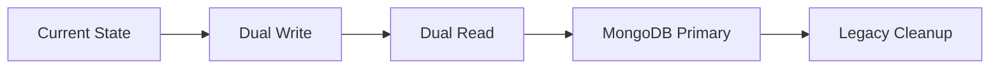

---

mode: agent
description: MongoDB Migration Master Plan - Complete overview and coordination of all migration phases
tools: [terminalLastCommand, codeBase, usages, testFailure, findTestFiles]
-----------------------------------------

# 🗺️ MongoDB Migration Master Plan

Complete migration strategy to move from `.env` files and local JSON storage to MongoDB Cloud database. This master plan coordinates all four phases and provides comprehensive guidance for the entire migration journey.

## 📋 Executive Summary

### Current State Analysis
- **Environment Variables**: 25+ configuration items in `.env` files
- **Local JSON Storage**: ~1MB of data across multiple JSON files
- **File-based Repositories**: 8+ file storage implementations
- **Single Jira Connection**: Limited to one Jira instance
- **No Real-time Analytics**: Limited reporting capabilities
- **Manual Configuration**: Environment-specific manual setup

### Target State Vision
- **Centralized Configuration**: All settings in MongoDB with environment-specific databases
- **Multi-Jira Support**: Connect to multiple Jira instances (Cloud & Server)
- **Real-time Analytics**: Live dashboards for HR, Accountant, and CEO viewers
- **Automated Lifecycle**: Intelligent data archiving and retention
- **High Availability**: 99.99% uptime with failover capabilities
- **Advanced Caching**: Multi-level caching for optimal performance

## 🎯 Migration Overview

### Phase Breakdown & Timeline

| Phase | Duration | Effort | Risk | Dependencies |
|-------|----------|--------|------|--------------|
| **Phase 1**: Foundation & Settings | 3-4 weeks | High | Medium | MongoDB setup |
| **Phase 2**: User & Session Data | 2-3 weeks | Medium | Low | Phase 1 complete |
| **Phase 3**: Business Data | 2-3 weeks | Medium | Low | Phases 1-2 complete |
| **Phase 4**: Advanced Features | 4-5 weeks | High | Medium | Phases 1-3 complete |
| **Total Project** | **11-15 weeks** | **High** | **Medium** | API Calendar service |

### Resource Requirements
- **Development**: 1 senior developer (primary), 1 mid-level developer (support)
- **DevOps**: 0.5 FTE for MongoDB setup and monitoring
- **Testing**: 0.3 FTE for comprehensive testing across all phases
- **Total Effort**: ~3-4 person-months

## 📊 Data Migration Scope

### Phase 1: Foundation & Settings Migration
```
Sources → Targets:
├── .env variables → mongodb.jira_connections
├── .env variables → mongodb.google_services_config
├── .env variables → mongodb.application_settings
├── .env variables → mongodb.telegram_config
└── .env variables → mongodb.user_authentication
```

### Phase 2: User & Session Data Migration
```
Sources → Targets:
├── data/storage/user_config.json → mongodb.user_profiles
├── data/storage/user_config.json → mongodb.user_preferences
├── data_store.json → mongodb.telegram_sessions
└── [New] → mongodb.user_activity_logs
```

### Phase 3: Business Data Migration
```
Sources → Targets:
├── data/storage/progress_reports.json → mongodb.progress_reports
├── data/notifier_log.jsonl → mongodb.notification_tracking
├── project configs → mongodb.project_metadata
├── [API Calendar] → mongodb.calendar_cache
└── [New] → mongodb.workflow_states
```

### Phase 4: Advanced Features (No Migration)
```
Enhancements:
├── Performance optimization
├── Real-time analytics
├── Advanced caching
├── Data lifecycle management
└── Dashboard integration
```

## 🏗️ Architecture Evolution

### Before Migration (Current)
```
┌─────────────────────────────────────────────────────────────┐
│                    Application Layer                        │
├─────────────────────────────────────────────────────────────┤
│                   Business Logic                           │
├─────────────────────────────────────────────────────────────┤
│    File Adapters    │    .env Settings    │   JSON Files   │
├─────────────────────────────────────────────────────────────┤
│  Local File System  │   Environment Vars  │  JSON Storage  │
└─────────────────────────────────────────────────────────────┘
```

### After Migration (Target)
```
┌─────────────────────────────────────────────────────────────┐
│                    Application Layer                        │
│              ┌─────────────────────────────────┐           │
│              │        Real-time Analytics       │           │
│              └─────────────────────────────────┘           │
├─────────────────────────────────────────────────────────────┤
│                   Business Logic                           │
├─────────────────────────────────────────────────────────────┤
│    MongoDB Adapters   │   Cache Layer   │   API Gateways   │
├─────────────────────────────────────────────────────────────┤
│  ┌─────────────────┐  │  ┌─────────────┐  │  ┌─────────────┐ │
│  │  MongoDB Atlas  │  │  │Redis/Memory │  │  │API Calendar │ │
│  │   (Primary)     │  │  │   Cache     │  │  │  Service    │ │
│  └─────────────────┘  │  └─────────────┘  │  └─────────────┘ │
└─────────────────────────────────────────────────────────────┘
```

## 🔄 Migration Strategy Details

### Environment Strategy (Best Practice Answer)
**Recommendation**: Separate databases per environment for isolation and security

```yaml
Development:
  database: jira_bot_dev
  connection_string: ${MONGODB_URI}/jira_bot_dev

Staging:
  database: jira_bot_staging
  connection_string: ${MONGODB_URI}/jira_bot_staging

Production:
  database: jira_bot_prod
  connection_string: ${MONGODB_URI}/jira_bot_prod
```

**Benefits**:
- Complete isolation between environments
- Safe testing without production impact
- Independent scaling and optimization
- Separate backup and recovery policies

### Migration Strategy (Best Practice Answer)
**Recommendation**: Dual-write pattern with gradual cutover



**Phase Approach**:
1. **Dual Write**: Write to both legacy and MongoDB
2. **Validation**: Verify data consistency between systems
3. **Dual Read**: Read from MongoDB with legacy fallback
4. **Primary**: MongoDB becomes primary with legacy backup
5. **Cleanup**: Remove legacy storage after validation period

**Benefits**:
- Zero downtime migration
- Immediate rollback capability
- Gradual confidence building
- Risk mitigation at each step

## 📋 Consolidated Interactive Variables

### Global Configuration
* `${input:mongodb_uri}` - MongoDB Atlas connection string
* `${input:environment}` - Environment: dev|staging|prod (default: dev)
* `${input:database_prefix}` - Database name prefix (default: jira_bot)
* `${input:enable_dual_write}` - Enable dual-write pattern (default: true)
* `${input:migration_batch_size}` - Batch size for migrations (default: 100)

### Phase-Specific Variables
* `${input:enable_multi_jira}` - Enable multi-Jira support (default: true)
* `${input:enable_caching}` - Enable caching layers (default: true)
* `${input:enable_real_time}` - Enable real-time features (default: true)
* `${input:enable_analytics}` - Enable advanced analytics (default: true)
* `${input:api_calendar_url}` - API Calendar service URL
* `${input:retention_days}` - Data retention period (default: 365)

## 🛠️ Implementation Roadmap

### Pre-Migration Setup (Week 0)
- [ ] MongoDB Atlas cluster setup
- [ ] Environment-specific database creation
- [ ] Connection string configuration
- [ ] Initial security setup
- [ ] Backup strategy implementation

### Phase 1: Foundation (Weeks 1-4)
- [ ] MongoDB connection infrastructure
- [ ] Base repository patterns
- [ ] Multi-Jira configuration support
- [ ] Google services migration
- [ ] User authentication migration
- [ ] Migration scripts and validation

### Phase 2: User Data (Weeks 5-7)
- [ ] User profile migration
- [ ] Telegram session migration
- [ ] Enhanced user preferences
- [ ] Session management
- [ ] User activity tracking

### Phase 3: Business Data (Weeks 8-10)
- [ ] Progress reports migration
- [ ] Notification tracking
- [ ] Project metadata centralization
- [ ] API Calendar integration
- [ ] Business analytics foundation

### Phase 4: Advanced Features (Weeks 11-15)
- [ ] Performance optimization
- [ ] Real-time analytics implementation
- [ ] Advanced caching deployment
- [ ] Data lifecycle management
- [ ] Grafana dashboard integration
- [ ] Monitoring and alerting setup

### Post-Migration Optimization (Week 16+)
- [ ] Performance tuning
- [ ] Capacity planning
- [ ] Legacy system decommission
- [ ] Documentation completion
- [ ] Team training and handover

## 📊 Dashboard Requirements

### HR Viewer Dashboard
**Purpose**: Human Resources management and team analytics
**Key Metrics**:
- Individual productivity scores and trends
- Team performance comparison
- Work-life balance indicators
- Skill development tracking
- Attendance and punctuality metrics
- Resource allocation efficiency

**Data Sources**:
- `user_profiles` (team structure)
- `progress_reports` (productivity data)
- `notification_tracking` (communication patterns)
- `user_activity_logs` (engagement metrics)

### Accountant Viewer Dashboard
**Purpose**: Financial analysis and cost management
**Key Metrics**:
- Project budget vs. actual costs
- Resource cost allocation and utilization
- Time tracking financial impact
- ROI calculations per project
- Overtime cost analysis
- Billable vs. non-billable hours

**Data Sources**:
- `progress_reports` (time tracking)
- `project_metadata` (budget information)
- `user_profiles` (resource costs)
- `workflow_states` (project progress)

### CEO Viewer Dashboard
**Purpose**: Strategic overview and executive decision making
**Key Metrics**:
- Overall company productivity KPIs
- Project delivery success rates
- Strategic goal achievement
- Revenue and growth indicators
- Market performance indicators
- Risk assessment metrics

**Data Sources**:
- Aggregated data from all collections
- Strategic KPI calculations
- High-level trend analysis
- Predictive analytics results

## 🔐 Security & Compliance

### Data Security
- **Encryption at Rest**: MongoDB field-level encryption for sensitive data
- **Encryption in Transit**: TLS 1.3 for all connections
- **Access Control**: Role-based access with principle of least privilege
- **Audit Logging**: Comprehensive audit trail for all data operations

### Compliance Considerations
- **GDPR Compliance**: User data anonymization and deletion capabilities
- **Data Retention**: Configurable retention policies per data type
- **Privacy Protection**: Pseudonymization of personal identifiers
- **Consent Management**: User consent tracking and management

### Backup & Recovery
- **Automated Backups**: Daily automated backups with point-in-time recovery
- **Cross-Region Replication**: Geographic backup distribution
- **Disaster Recovery**: RTO < 4 hours, RPO < 1 hour
- **Backup Validation**: Regular backup integrity testing

## 📈 Success Metrics & KPIs

### Technical KPIs
- **Migration Success**: 100% data migrated without loss
- **Performance**: 95th percentile query time < 100ms
- **Availability**: 99.99% uptime SLA
- **Data Integrity**: Zero data corruption incidents
- **Cache Efficiency**: >90% cache hit rate

### Business KPIs
- **User Experience**: Zero user-facing disruption during migration
- **Reporting Speed**: Dashboard load times < 3 seconds
- **Data Freshness**: Real-time data updates within 5 seconds
- **Storage Efficiency**: >50% reduction in storage costs
- **Operational Efficiency**: >30% reduction in manual configuration

### Project KPIs
- **Timeline Adherence**: Complete within planned 15-week timeline
- **Budget Control**: Stay within allocated budget
- **Quality Standards**: >90% test coverage across all phases
- **Documentation**: Complete documentation for all components
- **Team Satisfaction**: Positive feedback from development team

## ⚠️ Risk Management

### High-Risk Items
1. **Data Loss During Migration**: Multiple backup strategies and validation
2. **Performance Degradation**: Comprehensive testing and optimization
3. **Service Interruption**: Dual-write pattern and rollback procedures
4. **MongoDB Expertise Gap**: Training and external consultation if needed

### Medium-Risk Items
1. **Timeline Delays**: Buffer time and phased delivery approach
2. **Integration Complexity**: Thorough testing and staging environment
3. **User Adoption**: Training and change management support
4. **Cost Overruns**: Regular budget monitoring and scope management

### Risk Mitigation Strategies
- **Technical Risks**: Extensive testing, staging environment, rollback plans
- **Business Risks**: Phased delivery, user training, change management
- **Operational Risks**: Monitoring, alerting, incident response procedures
- **Financial Risks**: Budget tracking, scope control, regular reviews

## 🚀 Getting Started

### Immediate Next Steps
1. **Review and Approve Plan**: Stakeholder review and approval
2. **Resource Allocation**: Assign development team and timeline
3. **Environment Setup**: Configure MongoDB Atlas and development environment
4. **Phase 1 Kickoff**: Begin Foundation & Settings Migration
5. **Communication Plan**: Inform stakeholders about migration timeline

### Phase 1 Prerequisites
- MongoDB Atlas cluster provisioned
- Development environment configured
- Initial team training completed
- Phase 1 instruction document reviewed
- Migration validation criteria defined

---

**Remember**: This is a comprehensive migration that will transform your application's data architecture. Take time to understand each phase, ensure proper testing, and maintain clear communication with all stakeholders throughout the process.
