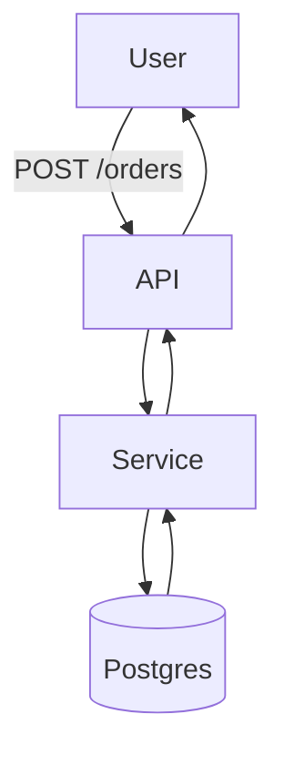

# 💡 Purpose  
Create a single `*.md` document that contains:

* A **Mermaid diagram** (draw.io-compatible) showing the overall flow.  
* A **Use-case reference** – one section per use-case.  
* An **Endpoint reference** – one section per endpoint.  
* A short **example** that demonstrates the required structure.

# 🗒️ Instructions  
1. Detect use-cases & endpoints (from selection or workspace).  
2. Prompt the user to confirm/edit the lists:  
   * `${input:usecases:Comma-separated list of use-cases}`  
   * `${input:endpoints:Comma-separated list of endpoints}`  
3. For each item, output:

   ```md
   ## <Name>
   ### Overview
   …
   ### Flow Diagram
   ```mermaid
   graph TD
     …
   ```
   ### Details
   * **Actors:**  
   * **Pre-conditions:**  
   * **Post-conditions:**  
   * **Steps:** 1. …
   ```

4. Put the big diagram first, followed by the per-item sections.  
5. Headings ≤ H3; tables only for clarity; wrap samples in fenced blocks.  
6. Return the finished Markdown file as the chat response.

# 📦 Mini example

```md
# Orders Service – Docs



## Use-case: **CreateOrder**
…
```
