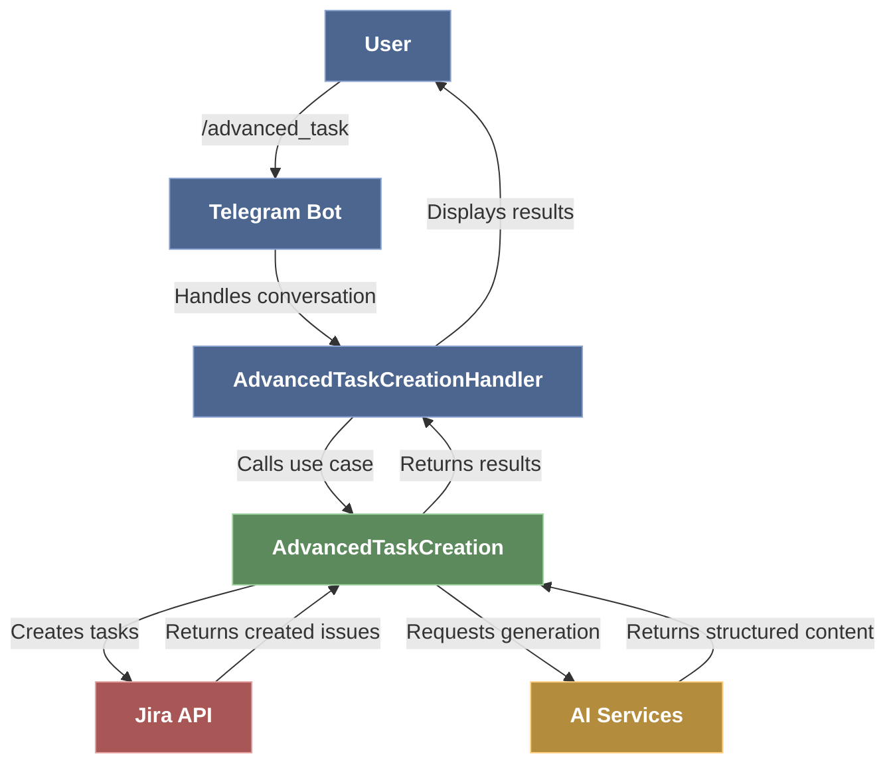
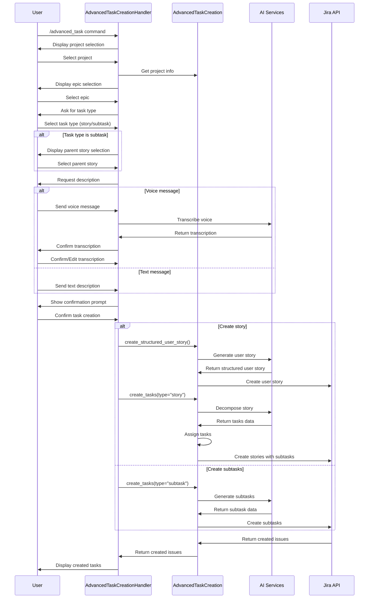

# Advanced Task Creation Flow

This document describes the flow of the Advanced Task Creation feature in the Jira Telegram Bot, which allows users to create structured user stories and automatically break down complex tasks into smaller, component-specific subtasks.

## Overview

The Advanced Task Creation system follows Clean Architecture principles with clear separation between:
1. **Entities** (business objects)
2. **Use Cases** (application logic)
3. **Adapters** (interface implementations)
4. **Frameworks** (external interfaces like Telegram)

## Architecture Components

### 1. AdvancedTaskCreation (Use Case)

Located at: `jira_telegram_bot/use_cases/telegram_commands/advanced_task_creation.py`

This is the core business logic class that handles:
- Creating structured user stories with proper acceptance criteria
- Breaking down complex tasks into smaller subtasks
- Assigning tasks to team members based on skill levels and departments
- Generating fallback solutions when AI processing fails

**Dependencies:**
- TaskManagerRepositoryInterface
- UserConfigInterface
- AiServiceProtocol
- PromptCatalogProtocol
- StoryGenerator
- StoryDecompositionInterface (optional)
- SubtaskCreationInterface (optional)

### 2. AdvancedTaskCreationHandler (Framework)

Located at: `jira_telegram_bot/frameworks/telegram/advanced_task_creation_handler.py`

This is the Telegram interface for the Advanced Task Creation use case, handling:
- Conversational flow for task creation
- Project and epic selection
- Task type selection (story or subtask)
- Processing text and voice message inputs
- Displaying task creation results

**Dependencies:**
- AdvancedTaskCreation
- SpeechProcessorInterface

## Flow Diagram

```
User Input → Telegram Bot → AdvancedTaskCreationHandler → AdvancedTaskCreation → Jira
                                                                  ↓
                                                         AI Service/Story Generator
```

### High-Level Flow Diagram (Mermaid)



### Sequence Diagram (Mermaid)



### Detailed Process Flow (Draw.io)

The detailed process flow diagram is available as a Draw.io file at `docs/advanced_task_creation_drawio.xml`

## Detailed Process Flow

### 1. Task Creation Flow

1. **Initialization**
   - User starts with `/advanced_task` command
   - Bot presents project selection options

2. **Project Selection**
   - User selects a project
   - Bot loads project-specific information
   - Bot offers epic selection options or "No Epic"

3. **Epic Selection**
   - User selects an epic or "No Epic"
   - Bot asks for task type (story or subtask)

4. **Task Type Selection**
   - If "story" is selected: Bot prompts for task description
   - If "subtask" is selected: Bot asks user to select a parent story

5. **Description Input**
   - User provides description via text or voice message
   - Voice messages are processed by SpeechProcessor for transcription
   - User confirms or retypes the description

6. **Task Creation**
   - Bot creates a structured user story via `create_structured_user_story()`
   - Bot creates tasks via `create_tasks()`
   - Tasks are assigned to team members based on expertise and complexity

7. **Result Display**
   - Bot shows created stories and subtasks with links to Jira

### 2. AI-Based Task Breakdown

1. **Story Generation**
   - Takes raw description and context (project, epic, etc.)
   - Generates well-structured user story with acceptance criteria

2. **Story Decomposition**
   - Breaks down user story into component-specific tasks
   - Assigns story points based on complexity

3. **Task Assignment**
   - Assigns tasks to team members based on:
     - Task complexity (story points)
     - Developer skill level (junior, mid-level, senior)
     - Department and team structure

## Key Methods

### AdvancedTaskCreation

- `create_structured_user_story()`: Creates a comprehensive user story
- `create_tasks()`: Creates multiple related tasks and subtasks
- `_generate_structured_user_story()`: Uses AI to generate story content
- `_parse_task_description()`: Analyzes description to extract task structure
- `_assign_tasks()`: Assigns tasks based on complexity and skill levels

### AdvancedTaskCreationHandler

- `start()`: Initiates conversation flow
- `select_project()`, `select_epic()`, `select_task_type()`: Handle user selections
- `handle_voice_message()`: Processes voice input via speech processor
- `process_description()`: Processes text description
- `create_tasks()`: Triggers task creation and displays results

## Fallback Mechanisms

The system includes robust fallback mechanisms for handling failures:

1. **Story Generation Fallback**
   - If AI fails to generate a user story, a basic template is used
   - Ensures tasks can still be created even with AI service issues

2. **Task Parsing Fallback**
   - If task breakdown fails, creates a simple story with investigation subtask
   - Preserves user input in description

## Example Usage

1. Start the advanced task creation process:
   ```
   /advanced_task
   ```

2. Select project, epic, and task type

3. Provide description (text or voice):
   ```
   Create a user management system with login, registration, and profile management.
   It should support social login and multi-factor authentication.
   ```

4. Review and confirm the task breakdown

5. Access created stories and subtasks in Jira
