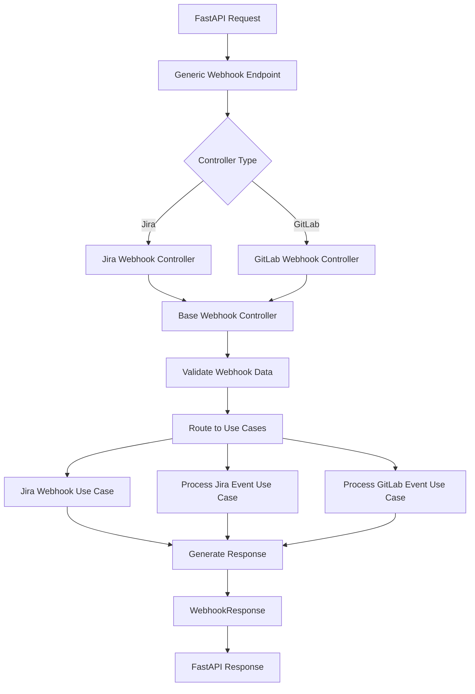
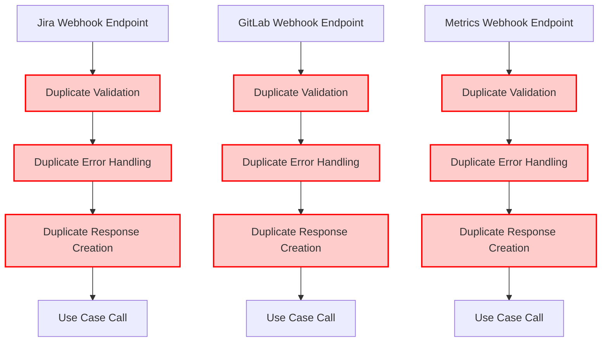
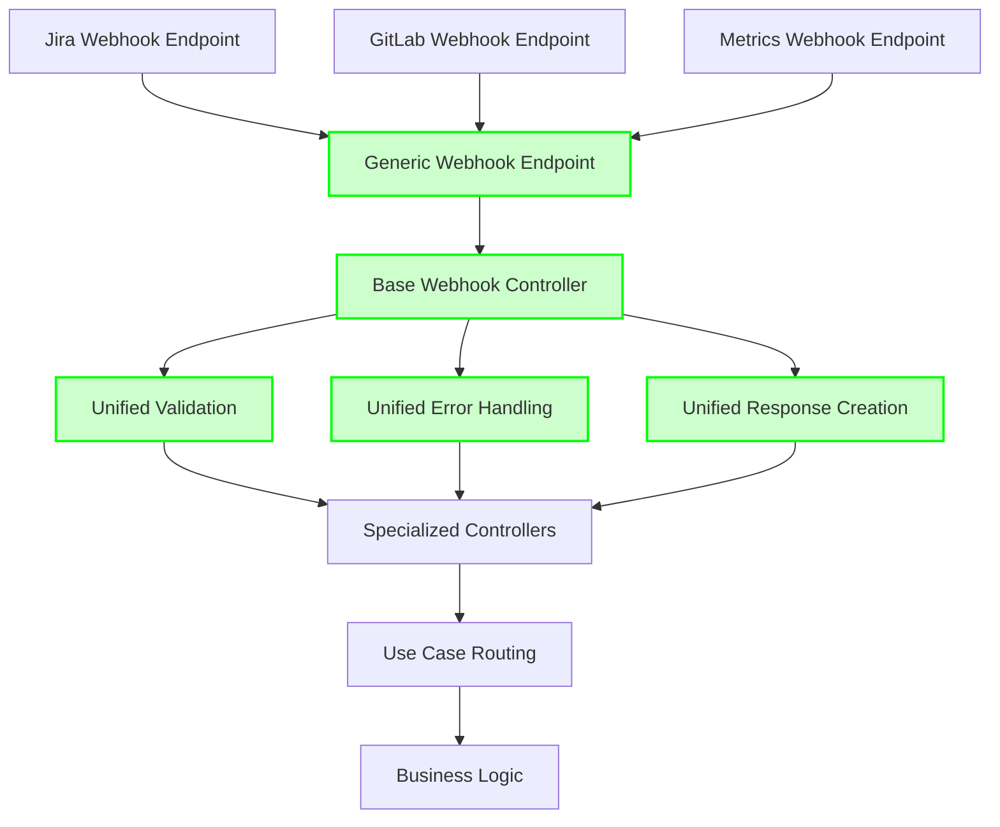
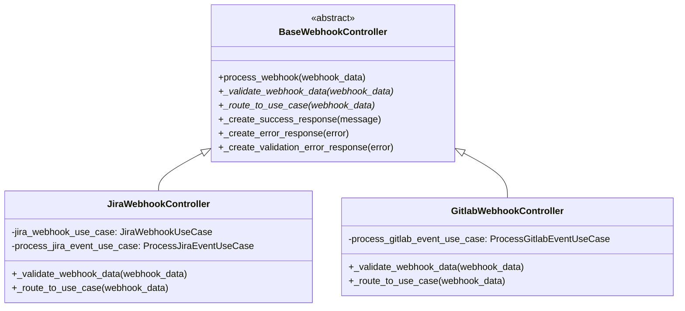
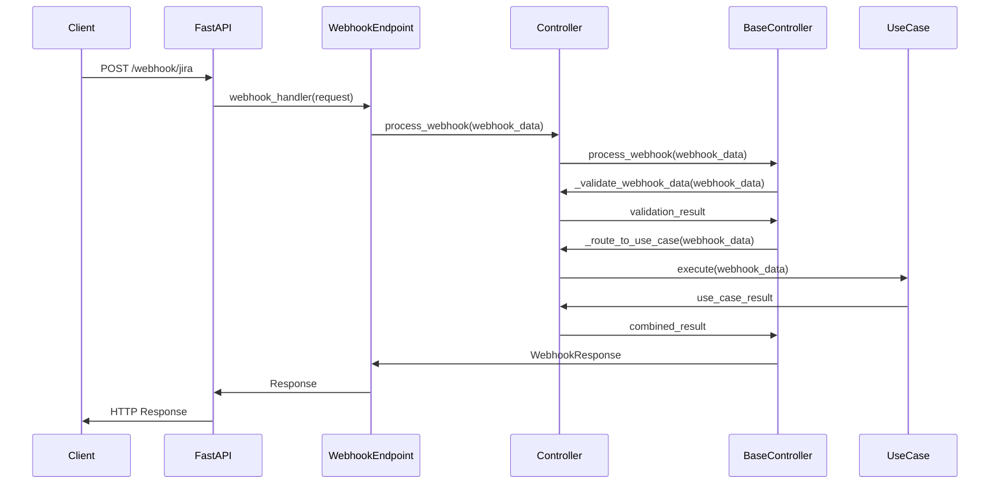
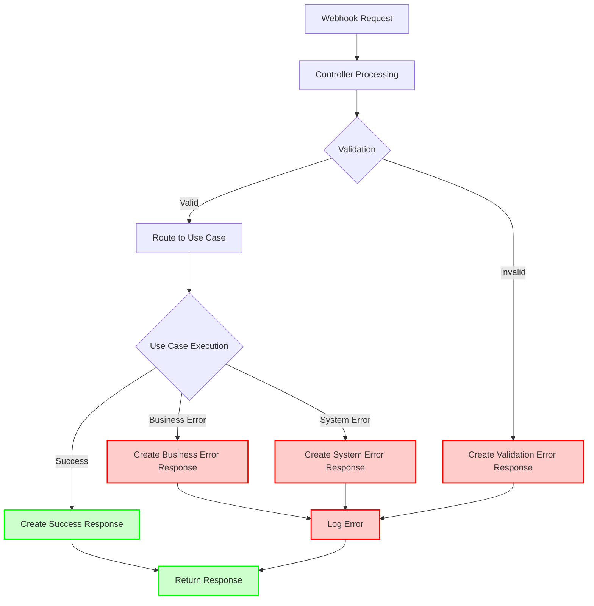
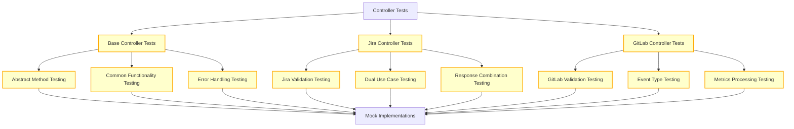
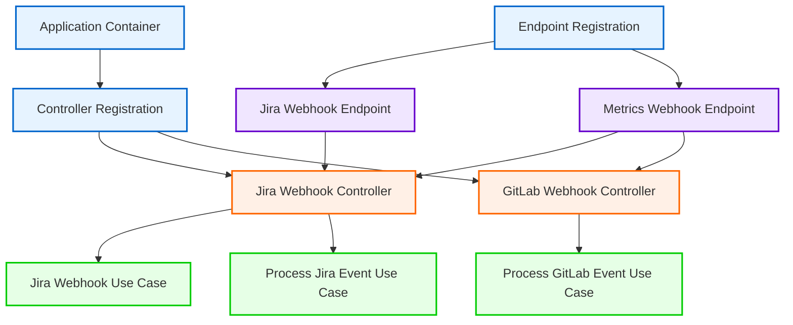
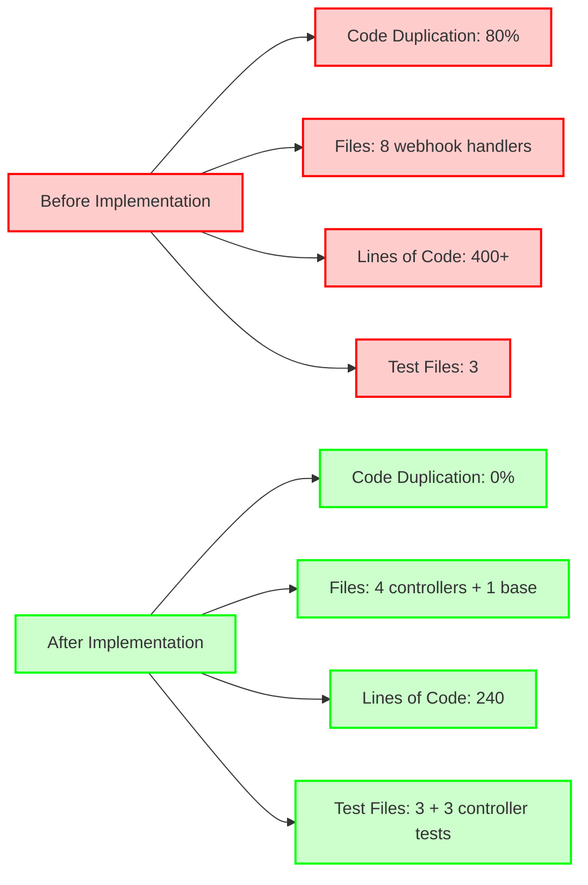

# Controller Layer Implementation - Mermaid Diagrams

## Architecture Overview

## Before vs After Architecture

### Before (Duplicated Code)

### After (Controller Layer)

## Controller Class Hierarchy

## Data Flow Diagram

## Error Handling Flow

## Testing Strategy

## Dependency Injection Flow

## Performance Comparison

