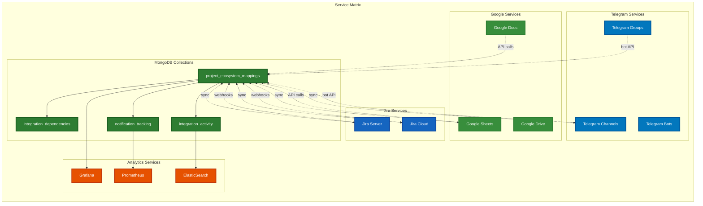
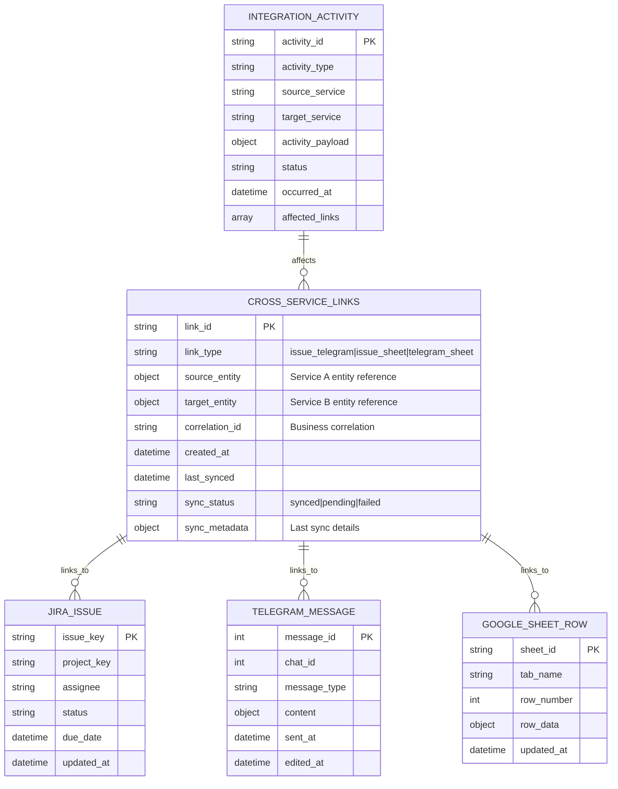
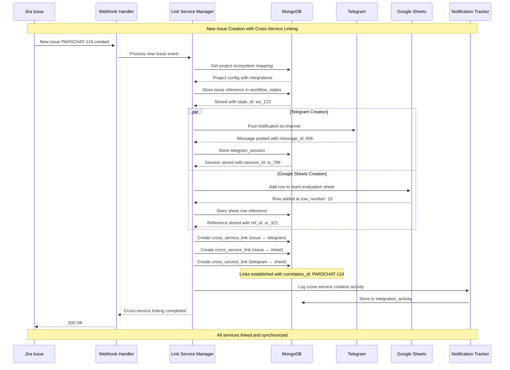
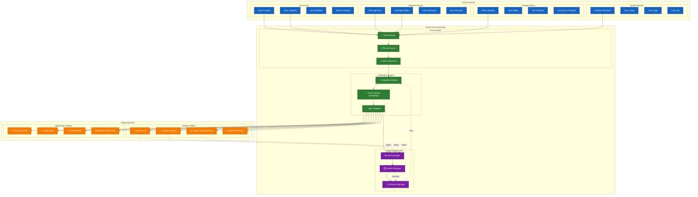
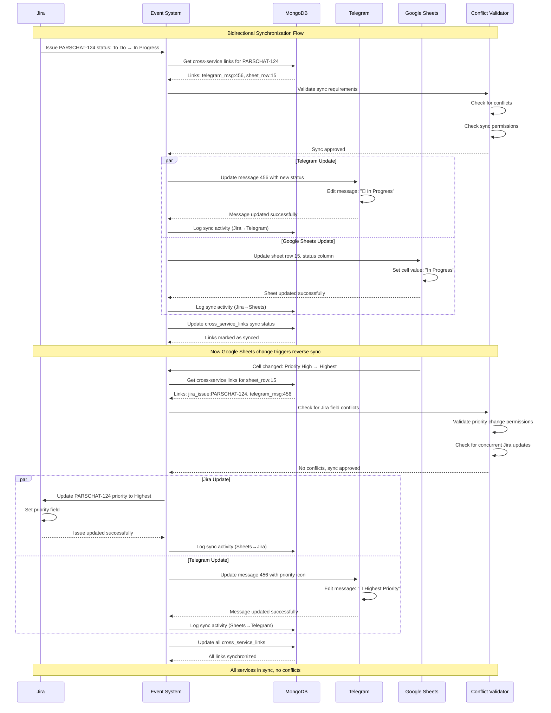
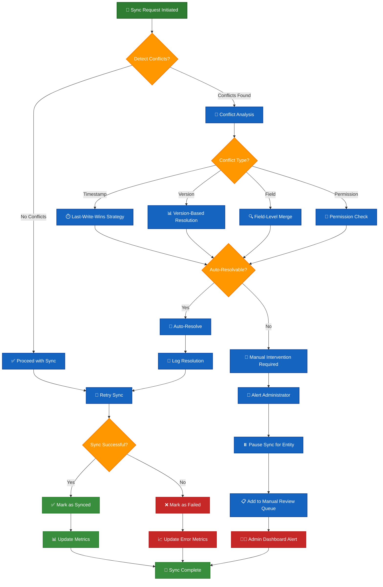
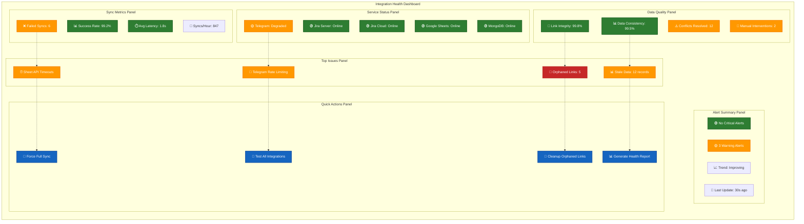

# 🔄 Cross-Service Integration Patterns

This document details the integration patterns and data synchronization mechanisms between all services in the MongoDB ecosystem.

## 📋 Table of Contents

1. [Integration Overview](#integration-overview)
2. [Cross-Service Linking](#cross-service-linking)
3. [Event Propagation Patterns](#event-propagation-patterns)
4. [Data Synchronization](#data-synchronization)
5. [Conflict Resolution](#conflict-resolution)
6. [Integration Monitoring](#integration-monitoring)

## 🌐 Integration Overview

### Service Integration Matrix

## 🔗 Cross-Service Linking

### Entity Linking Model

### Link Creation Process

## 📡 Event Propagation Patterns

### Event-Driven Synchronization

### Bidirectional Sync Pattern

## 🔄 Data Synchronization

### Sync Strategy Matrix

```mermaid
graph TB
    subgraph "Sync Strategies"
        subgraph "Real-Time Sync"
            RT1[🚀 Immediate Propagation]
            RT2[⚡ Webhook-Driven]
            RT3[📨 Event-Driven]
        end

        subgraph "Batch Sync"
            BT1[📅 Scheduled Sync]
            BT2[🔄 Periodic Reconciliation]
            BT3[📊 Bulk Updates]
        end

        subgraph "Hybrid Sync"
            HT1[🎯 Priority-Based]
            HT2[🔀 Mixed Mode]
            HT3[🚨 Fallback Sync]
        end
    end

    subgraph "Sync Triggers"
        subgraph "User Actions"
            UA1[✏️ Edit Issue]
            UA2[💬 Send Message]
            UA3[📝 Update Sheet]
        end

        subgraph "System Events"
            SE1[⏰ Deadline Alert]
            SE2[🔄 Status Change]
            SE3[📊 Report Generation]
        end

        subgraph "Scheduled Events"
            SC1[🌅 Daily Sync]
            SC2[📅 Weekly Reconciliation]
            SC3[🔍 Health Check]
        end
    end

    subgraph "Sync Validation"
        subgraph "Conflict Detection"
            CD1[🔍 Version Comparison]
            CD2[⏱️ Timestamp Check]
            CD3[📋 Field Validation]
        end

        subgraph "Integrity Checks"
            IC1[✅ Data Consistency]
            IC2[🔗 Link Validation]
            IC3[📊 State Verification]
        end

        subgraph "Recovery Actions"
            RA1[🔄 Retry Failed Sync]
            RA2[📞 Manual Intervention]
            RA3[🚨 Alert Generation]
        end
    end

    %% Real-time flows
    UA1 --> RT1
    UA2 --> RT2
    SE1 --> RT3

    %% Batch flows
    SC1 --> BT1
    SC2 --> BT2
    SE3 --> BT3

    %% Hybrid flows
    UA3 --> HT1
    SE2 --> HT2
    SC3 --> HT3

    %% Validation flows
    RT1 --> CD1
    RT2 --> CD2
    BT1 --> IC1
    BT2 --> IC2
    HT1 --> IC3

    %% Recovery flows
    CD1 --> RA1
    IC1 --> RA2
    IC3 --> RA3

    classDef realtime fill:#2e7d32,stroke:#1b5e20,stroke-width:2px,color:#fff
    classDef batch fill:#1565c0,stroke:#0d47a1,stroke-width:2px,color:#fff
    classDef hybrid fill:#7b1fa2,stroke:#6a1b9a,stroke-width:2px,color:#fff
    classDef trigger fill:#f57c00,stroke:#ef6c00,stroke-width:2px,color:#fff
    classDef validation fill:#c62828,stroke:#b71c1c,stroke-width:2px,color:#fff

    class RT1,RT2,RT3 realtime
    class BT1,BT2,BT3 batch
    class HT1,HT2,HT3 hybrid
    class UA1,UA2,UA3,SE1,SE2,SE3,SC1,SC2,SC3 trigger
    class CD1,CD2,CD3,IC1,IC2,IC3,RA1,RA2,RA3 validation
```

### Conflict Resolution Workflow

## 📊 Integration Monitoring

### Monitoring Architecture

```mermaid
graph TB
    subgraph "Monitoring Layers"
        subgraph "Application Monitoring"
            AM1[📊 Sync Success Rate]
            AM2[⏱️ Sync Latency]
            AM3[🚨 Error Rate]
            AM4[📈 Throughput]
        end

        subgraph "Service Health"
            SH1[🟢 Jira API Health]
            SH2[🟢 Telegram API Health]
            SH3[🟢 Google API Health]
            SH4[🟢 MongoDB Health]
        end

        subgraph "Business Metrics"
            BM1[📋 Data Consistency]
            BM2[🔗 Link Integrity]
            BM3[👤 User Satisfaction]
            BM4[⚡ System Performance]
        end

        subgraph "Alert Thresholds"
            AT1[🚨 Sync Failure > 5%]
            AT2[⏰ Latency > 30s]
            AT3[💥 API Errors > 10%]
            AT4[🔗 Broken Links > 1%]
        end
    end

    subgraph "Monitoring Infrastructure"
        subgraph "Data Collection"
            DC1[📊 Prometheus Metrics]
            DC2[📝 Application Logs]
            DC3[📈 MongoDB Metrics]
            DC4[🔍 Trace Data]
        end

        subgraph "Visualization"
            VI1[📊 Grafana Dashboards]
            VI2[📈 Real-time Charts]
            VI3[📋 Health Scorecards]
            VI4[🗺️ Service Maps]
        end

        subgraph "Alerting"
            AL1[📱 Slack Notifications]
            AL2[📧 Email Alerts]
            AL3[📞 PagerDuty Integration]
            AL4[🚨 Dashboard Alerts]
        end
    end

    %% Monitoring flows
    AM1 --> DC1
    AM2 --> DC1
    SH1 --> DC2
    SH2 --> DC2
    BM1 --> DC3
    BM2 --> DC3

    %% Visualization flows
    DC1 --> VI1
    DC2 --> VI2
    DC3 --> VI3
    DC4 --> VI4

    %% Alert flows
    AT1 --> AL1
    AT2 --> AL2
    AT3 --> AL3
    AT4 --> AL4

    %% Cross-connections
    VI1 --> AL4
    VI2 --> AL4
    DC1 --> AT1
    DC1 --> AT2
    DC2 --> AT3
    DC3 --> AT4

    classDef monitoring fill:#1565c0,stroke:#0d47a1,stroke-width:2px,color:#fff
    classDef infrastructure fill:#2e7d32,stroke:#1b5e20,stroke-width:2px,color:#fff
    classDef alerts fill:#c62828,stroke:#b71c1c,stroke-width:2px,color:#fff

    class AM1,AM2,AM3,AM4,SH1,SH2,SH3,SH4,BM1,BM2,BM3,BM4 monitoring
    class DC1,DC2,DC3,DC4,VI1,VI2,VI3,VI4 infrastructure
    class AT1,AT2,AT3,AT4,AL1,AL2,AL3,AL4 alerts
```

### Integration Health Dashboard

This comprehensive integration documentation shows how all services work together in a synchronized, monitored ecosystem with robust conflict resolution and health monitoring capabilities.
