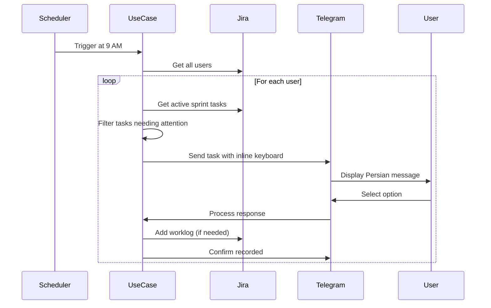

# Daily Task Tracker Documentation

## Overview

The Daily Task Tracker is an automated system that monitors team members' tasks daily and interacts with them via Telegram in **Persian (Farsi)**. It helps ensure tasks are started on time, tracks progress, validates worklogs, and detects issues.

## Features

### 1. **Smart Task Detection**
- Automatically identifies tasks in active sprints
- Filters tasks where:
  - Target start date has passed
  - All dependencies are completed
  - Status indicates attention needed

### 2. **Daily Check-Ins (Persian Interface)**
For each user's tasks, the bot asks:

#### **Task Not Started**
- Question: "چرا این تسک را شروع نکرده‌اید؟" (Why haven't you started this task?)
- Options:
  - منتظر تایید (Waiting for approval)
  - مشکل فنی (Technical blocker)
  - اولویت دیگر (Other priorities)
  - نیازمندی ناقص (Missing requirements)
  - وابستگی آماده نیست (Dependency not ready)
  - سایر (Other - custom input)
  - درخواست زیرتسک (Request subtasks from PO)

#### **Task In Progress**
- Question: "چند ساعت امروز روی این تسک کار کرده‌اید؟" (How many hours did you work today?)
- Options: 1, 2, 3, 4, 6, 8 hours, or custom

#### **Task Done/Reviewed Without Worklog**
- Question: "این تسک تکمیل شده است. چند ساعت روی آن کار کرده‌اید؟"
- Automatically logs worklog to Jira
- Options: 1, 2, 3, 4, 6, 8 hours, or custom

### 3. **Status Regression Detection**
- Monitors tasks moved from "Review" → "Backlog"
- Checks if moved by reporter, QA, or tester (not assignee)
- Sends notification to assignee with details

### 4. **PO Integration**
- Users can request subtask creation
- Bot finds PO from `projects_info.json`
- Sends notification to PO's Telegram

## Architecture

### Clean Architecture Layers

```
entities/
├── daily_task_tracking/
│   ├── daily_task_check.py          # Task check entity
│   ├── daily_task_status.py         # Status enums
│   ├── task_progress_report.py      # Progress report entity
│   ├── worklog_entry.py              # Worklog entity
│   └── task_status_change.py        # Status change entity
└── constants/
    └── persian_messages.py           # All Persian text

use_cases/
├── daily_task_tracking/
│   ├── get_user_daily_tasks_use_case.py
│   ├── validate_worklog_use_case.py
│   ├── detect_status_regression_use_case.py
│   ├── record_delay_reason_use_case.py
│   ├── record_time_spent_use_case.py
│   ├── record_worklog_use_case.py
│   ├── request_subtask_creation_use_case.py
│   └── send_daily_task_reminders_use_case.py
└── interfaces/
    └── daily_task_tracking_repository_interface.py

adapters/
└── repositories/
    └── file_storage/
        └── file_daily_task_tracking_repository.py

frameworks/
├── telegram/
│   └── daily_task_tracking_handler.py
└── scheduler/
    └── daily_task_tracker_job.py

settings/
└── daily_task_tracker_settings.py

scripts/
└── run_daily_task_tracker.py
```

## Configuration

### Environment Variables

```bash
# Enable/disable the service
DAILY_TASK_TRACKER_ENABLED=true

# Cron schedule (default: 9 AM daily)
DAILY_TASK_TRACKER_CRON_SCHEDULE="0 9 * * *"

# Timezone
DAILY_TASK_TRACKER_TIMEZONE="Asia/Tehran"

# Skip weekends
DAILY_TASK_TRACKER_EXCLUDE_WEEKENDS=true

# Skip holidays
DAILY_TASK_TRACKER_EXCLUDE_HOLIDAYS=true

# Hours to look back for status regressions
DAILY_TASK_TRACKER_REGRESSION_LOOKBACK_HOURS=24
```

## Docker Deployment

### Service Configuration

```yaml
daily-task-tracker:
  build:
    context: .
    dockerfile: Dockerfile
  container_name: daily_task_tracker
  image: jira_telegram_bot:v3
  volumes:
    - .:/app
  command: >
    python3 scripts/run_daily_task_tracker.py
  restart: always
  environment:
    - DAILY_TASK_TRACKER_ENABLED=true
    - DAILY_TASK_TRACKER_CRON_SCHEDULE=0 9 * * *
    - DAILY_TASK_TRACKER_TIMEZONE=Asia/Tehran
```

### Running the Service

```bash
# Start the service
docker-compose up -d daily-task-tracker

# View logs
docker-compose logs -f daily-task-tracker

# Stop the service
docker-compose stop daily-task-tracker

# Run once for testing
docker-compose exec daily-task-tracker python3 scripts/run_daily_task_tracker.py --once
```

## User Configuration

### Required in `user_config.json`

Each user must have:
```json
{
  "telegram_username": {
    "jira_username": "john.doe",
    "telegram_user_chat_id": 123456789,
    "telegram_username": "johndoe"
  }
}
```

### Required in `projects_info.json`

Each project must define PO:
```json
{
  "PROJECT_KEY": {
    "po_username": "jane.doe",
    ...
  }
}
```

## Workflow

### Daily Execution Flow



## Data Storage

### Progress Reports

Stored in: `data/storage/daily_task_tracking.jsonl`

Format: JSON Lines (one report per line)

```json
{
  "report_id": "uuid",
  "issue_key": "TEST-123",
  "user_jira_username": "john.doe",
  "report_date": "2026-01-02T09:00:00",
  "delay_reason": "technical_blocker",
  "hours_spent": 4.0,
  "worklog_added": true
}
```

## Task Filtering Logic

### Tasks Needing Attention

A task needs attention if:

1. **Should Be Started:**
   - Status: "To Do", "Open", "Backlog"
   - Target start date ≤ Today
   - All dependencies completed

2. **In Progress:**
   - Status: "In Progress", "Doing"
   - Daily progress tracking needed

3. **Needs Worklog:**
   - Status: "Done", "Resolved", "Closed", "Review"
   - Worklog hours = 0

4. **Status Regressed:**
   - Changed from "Review" → "Backlog" in last 24h
   - Changed by reporter/QA/tester (not assignee)

## Testing

### Unit Tests

```bash
# Run all daily task tracking tests
pytest tests/unit_tests/use_cases/daily_task_tracking/

# Run specific test
pytest tests/unit_tests/use_cases/daily_task_tracking/test_get_user_daily_tasks_use_case.py
```

### Manual Testing

```bash
# Run once without waiting for schedule
python scripts/run_daily_task_tracker.py --once

# Check logs
tail -f data/storage/daily_task_tracking.jsonl
```

## Troubleshooting

### Common Issues

1. **No messages sent:**
   - Check `DAILY_TASK_TRACKER_ENABLED=true`
   - Verify users have `telegram_user_chat_id` in user_config.json
   - Check users have started the Telegram bot

2. **Worklog not added to Jira:**
   - Check Jira credentials
   - Verify user has permission to add worklogs
   - Check Jira logs

3. **PO not notified:**
   - Verify `po_username` in projects_info.json
   - Check PO has `telegram_user_chat_id`
   - Verify PO started the bot

### Logs

Check logs for debugging:
```bash
# Docker logs
docker-compose logs -f daily-task-tracker

# Application logs (if running locally)
tail -f logs/daily_task_tracker.log
```

## Future Enhancements

- [ ] Holiday calendar integration
- [ ] Custom scheduling per user
- [ ] Worklog comments from user input
- [ ] Team summary reports
- [ ] Integration with time tracking systems
- [ ] Mobile app notifications

## Support

For issues or questions:
- Check logs first
- Review configuration
- Test with `--once` flag
- Contact development team

---

**Version:** 1.0.0  
**Last Updated:** January 2, 2026  
**Language:** Persian (Farsi) interface, English documentation
