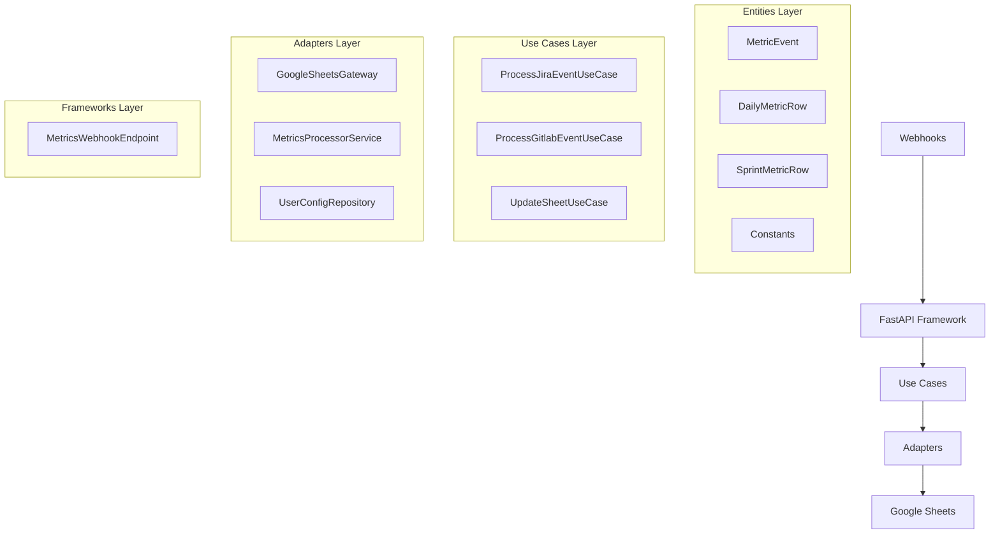

# Metrics Tracking System Documentation

## Overview

The Metrics Tracking System is a comprehensive solution for automatically collecting, processing, and visualizing development metrics from Jira and GitLab webhooks. The system follows Clean Architecture principles and provides real-time updates to Google Sheets for tracking daily developer performance and sprint-level metrics.

## Architecture

### Components Overview



### Data Flow

1. **Webhook Reception**: FastAPI endpoints receive Jira/GitLab webhooks
2. **Event Mapping**: Raw webhook payloads are mapped to `MetricEvent` entities
3. **Idempotency Check**: System checks if event was already processed
4. **Metrics Processing**: Events are processed and appropriate sheets are updated
5. **Sheet Updates**: Google Sheets are updated with new metric data

## Entities

### MetricEvent

Core entity representing a trackable development activity:

```python
@dataclass
class MetricEvent:
    event_id: str              # Unique identifier for idempotency
    metric_type: MetricType    # Type of metric (task_created, commit_made, etc.)
    developer_key: str         # Developer identifier (email)
    timestamp: datetime        # When the event occurred
    value: float              # Numeric value (hours, story points, count)
    project_key: str          # Jira project key
    issue_key: Optional[str]  # Jira issue key
    sprint_id: Optional[str]  # Sprint identifier
    metadata: Dict[str, Any]  # Additional event data
```

### MetricType Enum

Supported metric types:

- `TASK_CREATED` - New task/issue created
- `TASK_UPDATED` - Task/issue updated
- `TASK_RESOLVED` - Task/issue resolved
- `TASK_REOPENED` - Task/issue reopened
- `TIME_LOGGED` - Time logged on task
- `COMMIT_MADE` - Git commit made
- `MERGE_REQUEST_OPENED` - MR/PR opened
- `MERGE_REQUEST_MERGED` - MR/PR merged
- `MERGE_REQUEST_CLOSED` - MR/PR closed
- `DEADLINE_HIT` - Deadline met
- `DEADLINE_MISSED` - Deadline missed

### DailyMetricRow

Represents a row in the daily scoreboard sheet:

```python
@dataclass
class DailyMetricRow:
    developer_name: str        # Display name
    metric_date: date         # Date for metrics
    today_deadlines: int      # Number of deadlines today
    resolved_tasks: int       # Tasks resolved today
    logged_time: float        # Hours logged today
    commits: int              # Commits made today
    comments: Optional[str]   # Latest work description
```

### SprintMetricRow

Represents a row in the sprint metrics matrix:

```python
@dataclass
class SprintMetricRow:
    developer_name: str           # Display name
    all_tasks: int               # Total tasks assigned
    completed_tasks: int         # Tasks completed
    resolved_stories: int        # Stories resolved
    resolved_bugs: int           # Bugs resolved
    logged_time: float           # Total hours logged
    merge_requests: int          # MRs opened
    successful_merges: int       # MRs merged
    # ... additional metrics
```

## Use Cases

### ProcessJiraEventUseCase

Processes Jira webhook events and converts them to metric events.

**Responsibilities:**
- Map Jira webhook payloads to `MetricEvent` instances
- Extract relevant metadata (assignee, project, sprint, etc.)
- Handle different event types (created, updated, resolved, etc.)
- Process worklog events for time tracking

**Key Methods:**
- `process_jira_webhook(webhook_data)` - Main processing method
- `_map_webhook_to_metric_event(webhook_data)` - Event mapping logic
- `_extract_sprint_id(issue_data)` - Sprint extraction
- `_calculate_metric_value(event_type, webhook_data)` - Value calculation

### ProcessGitlabEventUseCase

Processes GitLab webhook events for commit and merge request tracking.

**Responsibilities:**
- Handle GitLab push events (commits)
- Handle GitLab merge request events
- Extract project information from GitLab payloads
- Map GitLab users to system developers

**Key Methods:**
- `process_gitlab_webhook(webhook_data)` - Main processing method
- `_create_commit_event(commit, webhook_data)` - Commit event creation
- `_create_merge_request_event(webhook_data)` - MR event creation

### UpdateSheetUseCase

Updates Google Sheets with metric data using idempotent operations.

**Responsibilities:**
- Update daily scoreboard sheet
- Update sprint metrics matrix
- Handle row creation and updates
- Implement retry logic with exponential backoff

**Key Methods:**
- `update_daily_scoreboard(event)` - Update daily metrics
- `update_sprint_matrix(event)` - Update sprint metrics
- `_find_daily_row_index()` - Locate existing rows
- `_update_daily_row()` - Update existing data

## Adapters

### GoogleSheetsGateway

Implements the `SpreadsheetGatewayInterface` using Google Sheets API.

**Capabilities:**
- Append new rows to sheets
- Update specific cell ranges
- Read sheet values
- Create new sheets
- Batch operations for efficiency

### MetricsProcessorService

Orchestrates metric event processing and determines which sheets to update.

**Features:**
- Routes events to appropriate sheets
- Implements idempotency checking
- Manages in-memory event cache
- Handles processing errors gracefully

### FileUserSettingConfigurationRepository

File-based repository for configuration management.

**Configuration Structure:**
```json
{
  "sheets": {
    "daily_scoreboard": {
      "sheet_id": "your_sheet_id",
      "range_template": "Daily!A:G"
    },
    "developer_metrics_matrix": {
      "sheet_id": "your_sheet_id",
      "range_template": "Sprint!A:P"
    }
  },
  "developers": {
    "john.doe@example.com": {
      "display_name": "John Doe",
      "jira_username": "john.doe",
      "gitlab_username": "jdoe"
    }
  }
}
```

## Framework Layer

### MetricsWebhookEndpoint

FastAPI endpoint for receiving webhooks from Jira and GitLab.

**Endpoints:**
- `POST /metrics/jira` - Jira webhook processing
- `POST /metrics/gitlab` - GitLab webhook processing
- `GET /metrics/health` - Health check

**Features:**
- Asynchronous processing via background tasks
- Error handling and logging
- Webhook validation
- Response standardization

## Configuration

### Environment Variables

Required environment variables for Google Sheets integration:

```bash
# Google Sheets
GOOGLE_SERVICE_ACCOUNT_FILE=/path/to/service-account.json
DAILY_SCOREBOARD_SHEET_ID=your_daily_sheet_id
SPRINT_MATRIX_SHEET_ID=your_sprint_sheet_id

# Webhook Authentication (optional)
WEBHOOK_SECRET_TOKEN=your_secret_token
```

### Google Sheets Setup

1. Create Google Service Account
2. Download service account JSON file
3. Share target sheets with service account email
4. Configure sheet IDs in environment or config file

### Sheet Formats

#### Daily Scoreboard Format
| Column | Field | Description |
|--------|-------|-------------|
| A | Developer Name | Display name |
| B | Date | Date (YYYY-MM-DD) |
| C | Today Deadlines | Count of deadlines |
| D | Resolved Tasks | Count of resolved tasks |
| E | Logged Time | Hours logged |
| F | Commits | Number of commits |
| G | Comments | Latest work description |

#### Sprint Metrics Matrix Format
| Column | Field | Description |
|--------|-------|-------------|
| A | Developer Name | Display name |
| B | All Tasks | Total assigned tasks |
| C | Completed Tasks | Completed tasks |
| D | Releases Related | Release contributions |
| E | Stories Related | Story involvement |
| F | Resolved Stories | Stories resolved |
| G | Resolved Bugs | Bugs resolved |
| H | Delivery Delay | Days of delay |
| I | Bug Delivery Delay | Bug fix delays |
| J | Logged Time | Total hours |
| K | ETA All Tasks | Estimated completion |
| L | Support Epic Time | Support hours |
| M | Meeting Time | Meeting hours |
| N | Doc Merge Requests | Documentation MRs |
| O | Merge Requests | Total MRs |
| P | Successful Merges | Merged MRs |

## Testing

### Unit Tests

Located in `tests/unit_tests/use_cases/metrics/`:

- `test_process_jira_event_use_case.py` - Jira event processing tests
- `test_process_gitlab_event_use_case.py` - GitLab event processing tests
- `test_update_sheet_use_case.py` - Sheet update logic tests

### Integration Tests

Located in `tests/integration/metrics/`:

- `test_metrics_webhook_integration.py` - End-to-end webhook processing tests

### Running Tests

```bash
# Run unit tests
python -m pytest tests/unit_tests/use_cases/metrics/ -v

# Run integration tests
python -m pytest tests/integration/metrics/ -v

# Run with coverage
python -m pytest tests/unit_tests/use_cases/metrics/ --cov=jira_telegram_bot.use_cases.metrics
```

## Deployment

### Webhook Configuration

#### Jira Webhook Setup
1. Go to Jira Administration → System → Webhooks
2. Create new webhook with URL: `https://your-domain/metrics/jira`
3. Select events: Issue Created, Updated, Resolved, Worklog
4. Configure authentication if required

#### GitLab Webhook Setup
1. Go to Project → Settings → Webhooks
2. Add webhook URL: `https://your-domain/metrics/gitlab`
3. Select triggers: Push events, Merge request events
4. Configure secret token if required

### Docker Deployment

```dockerfile
# Add to existing Dockerfile
COPY jira_telegram_bot/entities/metrics/ /app/jira_telegram_bot/entities/metrics/
COPY jira_telegram_bot/use_cases/metrics/ /app/jira_telegram_bot/use_cases/metrics/
COPY jira_telegram_bot/adapters/gateways/google_sheets/ /app/jira_telegram_bot/adapters/gateways/google_sheets/
COPY jira_telegram_bot/frameworks/fastapi/webhooks/metrics/ /app/jira_telegram_bot/frameworks/fastapi/webhooks/metrics/

# Set environment variables
ENV GOOGLE_SERVICE_ACCOUNT_FILE=/app/config/service-account.json
ENV DAILY_SCOREBOARD_SHEET_ID=your_daily_sheet_id
ENV SPRINT_MATRIX_SHEET_ID=your_sprint_sheet_id
```

## Monitoring and Troubleshooting

### Logging

The system provides comprehensive logging at different levels:

- **DEBUG**: Detailed processing information
- **INFO**: Successful operations and metrics
- **WARNING**: Non-critical issues (missing mappings, etc.)
- **ERROR**: Processing failures and exceptions

### Common Issues

1. **Authentication Errors**: Verify Google service account permissions
2. **Sheet Not Found**: Check sheet IDs and sharing permissions
3. **Developer Mapping**: Ensure developer emails match webhook payloads
4. **Idempotency Issues**: Check event ID generation logic
5. **Rate Limiting**: Implement appropriate backoff strategies

### Performance Metrics

Monitor these key metrics:

- Webhook processing time
- Sheet update success rate
- Event processing throughput
- Error rates by event type
- Idempotency hit rate

## Future Enhancements

### Planned Features

1. **Persian Calendar Support**: Monthly sheet creation based on Persian calendar
2. **Advanced Analytics**: Trend analysis and performance insights
3. **Notification System**: Alerts for metric thresholds
4. **Dashboard UI**: Web interface for metric visualization
5. **Data Export**: CSV/Excel export capabilities
6. **API Endpoints**: REST API for metric queries

### Scalability Considerations

1. **Database Storage**: Move from file-based to database storage
2. **Queue System**: Implement message queue for webhook processing
3. **Caching**: Add Redis for idempotency and configuration caching
4. **Horizontal Scaling**: Support multiple application instances
5. **Batch Processing**: Aggregate multiple events for bulk updates
