# Department Dependencies - Visual Diagrams

## System Architecture

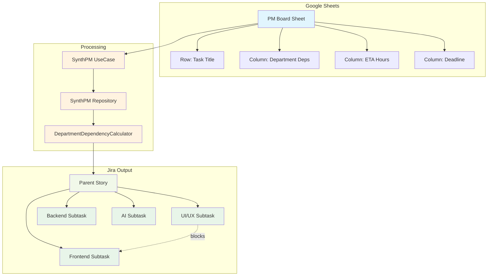

## Dependency Parsing Flow

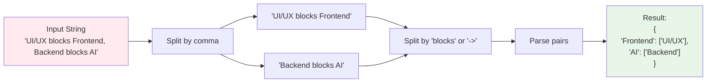

## Timeline Calculation Example

### Example 1: Simple Chain (UI/UX blocks Frontend)

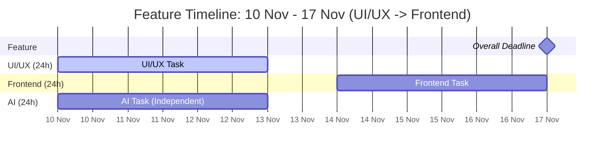

**Explanation:**
- UI/UX starts immediately (10 Nov) and takes 3 days → ends 13 Nov
- Frontend **depends on** UI/UX, so starts 14 Nov → ends 17 Nov
- AI has no dependencies, starts 10 Nov (parallel with UI/UX) → ends 13 Nov

### Example 2: Multiple Blockers (UI/UX blocks Frontend, Backend blocks Frontend)

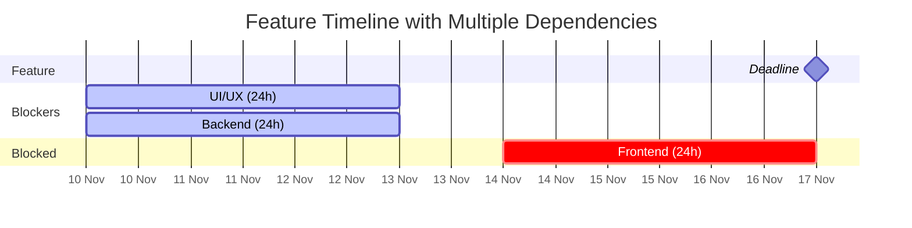

**Explanation:**
- Both UI/UX and Backend start at 10 Nov (parallel)
- Frontend can only start after **both** complete (14 Nov)
- Frontend ends at deadline (17 Nov)

### Example 3: Complex Chain (UI/UX blocks Frontend blocks Backend blocks AI)

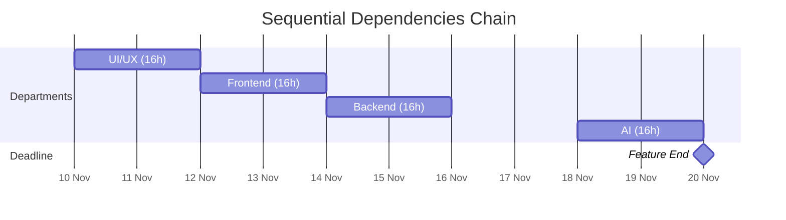

**Explanation:**
- Each department depends on the previous one completing
- Working backwards from 20 Nov deadline:
  - AI: 18-20 Nov
  - Backend: 14-16 Nov (skipping Friday 17th)
  - Frontend: 12-14 Nov
  - UI/UX: 10-12 Nov

## Dependency Graph Structures

### Parallel Work (No Dependencies)

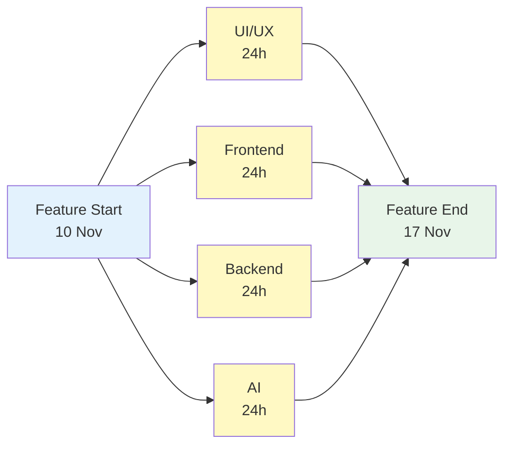

### Sequential Work (Chain Dependencies)

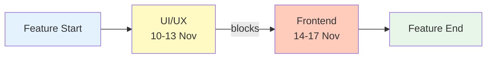

### Mixed Dependencies

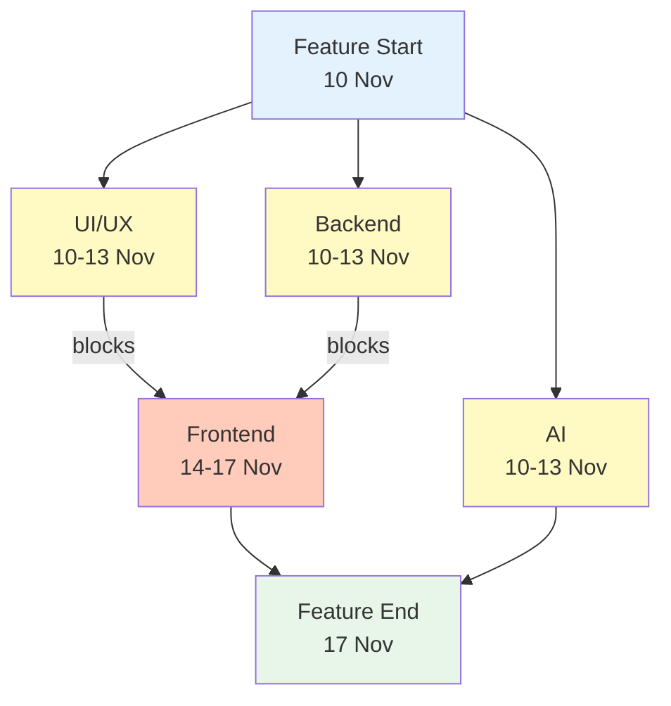

**Key:**
- 🟨 Yellow: Independent tasks (start immediately)
- 🟧 Orange: Dependent tasks (wait for blockers)
- 🔵 Blue: Start milestone
- 🟢 Green: End milestone

## Jira Subtask Structure

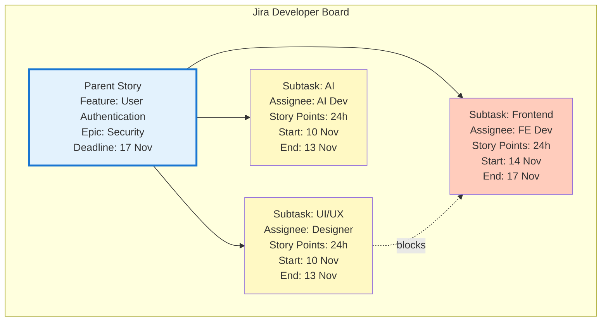

## Date Calculation Algorithm

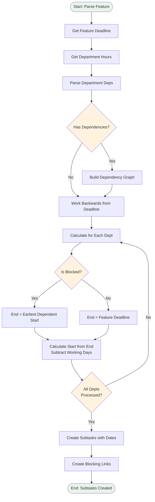

## Working Day Calculation

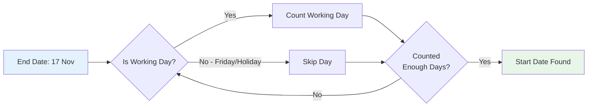

**Working Day Rules:**
- 1 day = 8 hours
- Friday is excluded (Iranian weekend)
- Holidays are excluded (from Jira settings)
- Algorithm works backwards from end date

## Integration Flow

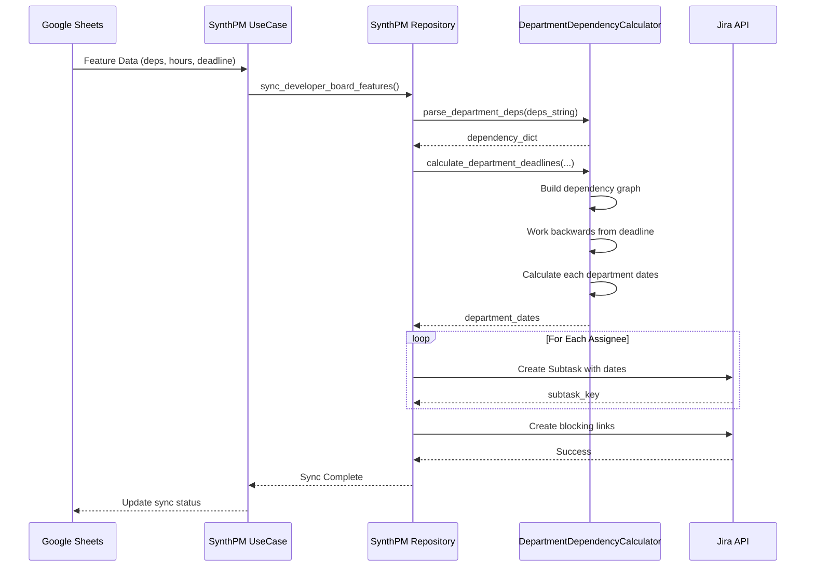

## Error Handling Flow

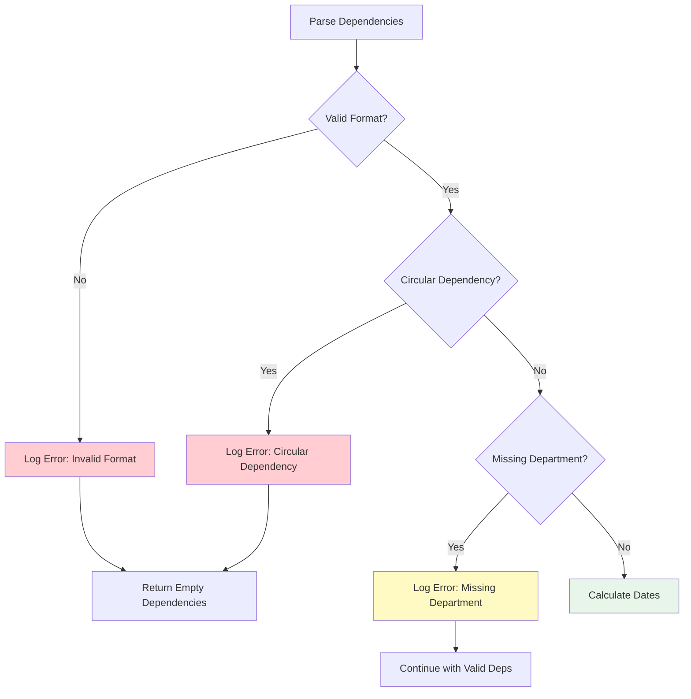

---

**Usage Notes:**
- These diagrams use Mermaid syntax and will render in GitHub, VS Code, and most modern documentation tools
- Colors indicate different states and dependency relationships
- Timeline diagrams show actual working days excluding Fridays
- All examples assume 8-hour workdays and Friday weekends

