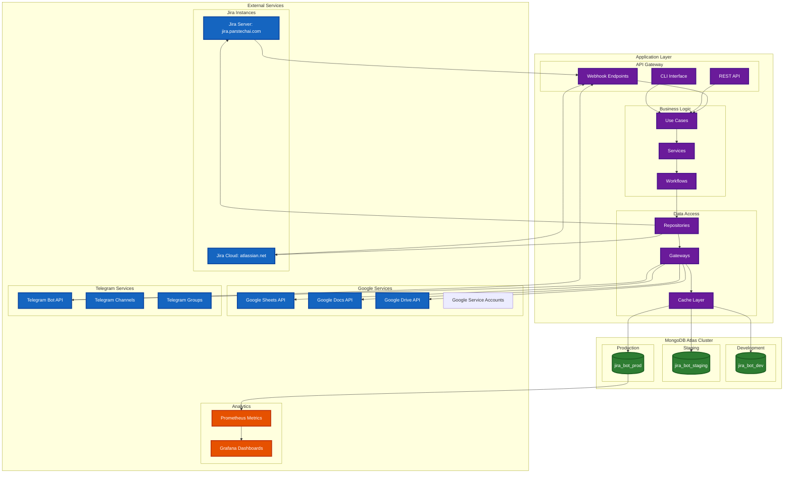
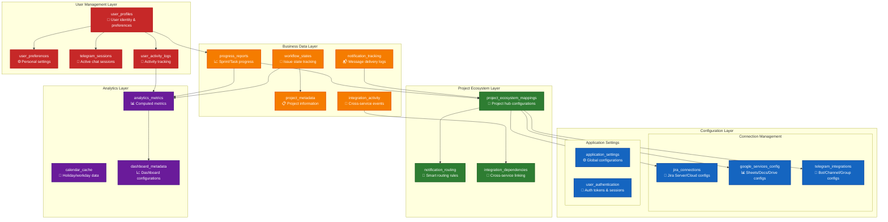
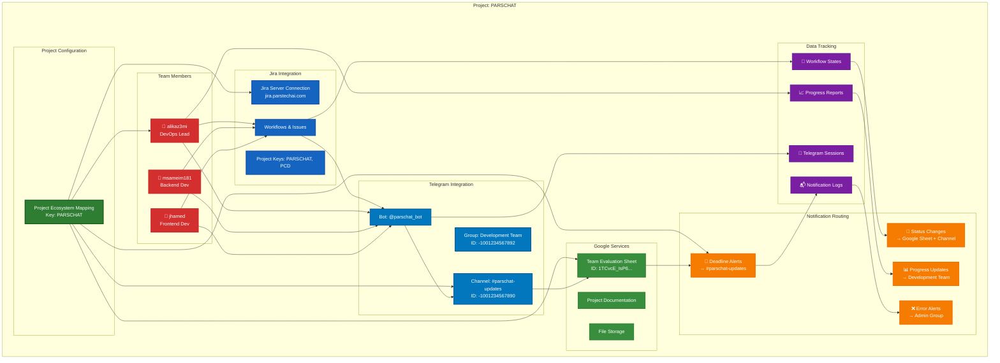
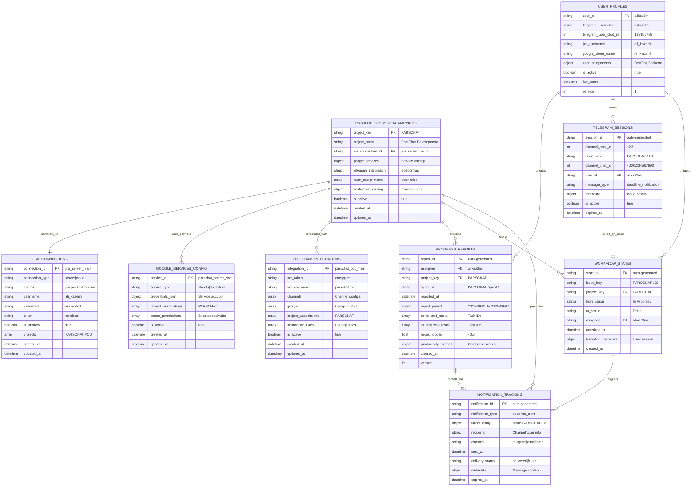
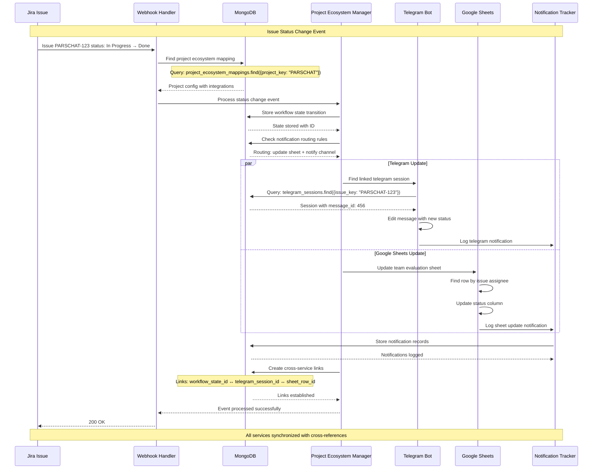
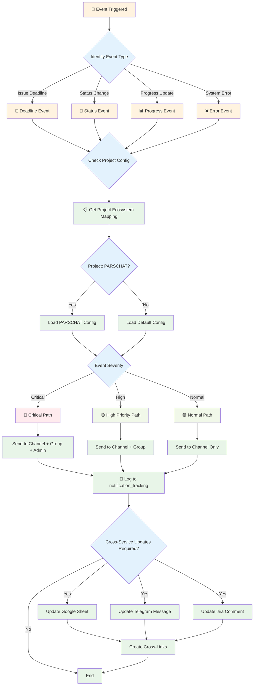
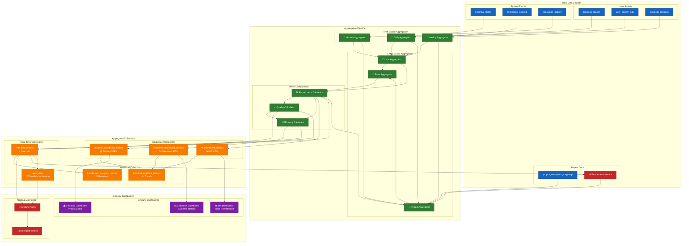
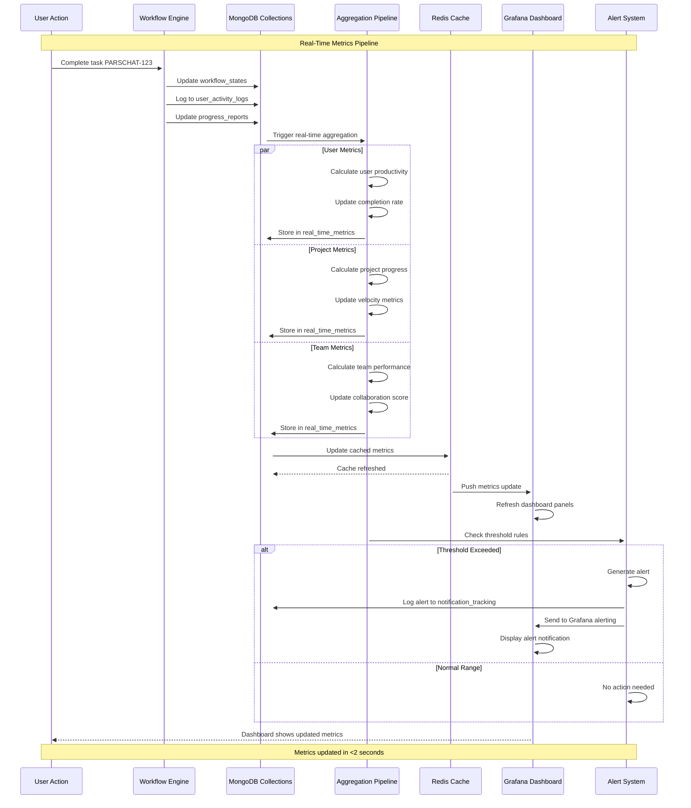

# 🏛️ MongoDB Database Architecture Diagrams

This document contains detailed mermaid diagrams showing the complete architecture of the MongoDB database ecosystem for the jira-telegram-bot application.

## 📊 High-Level System Architecture

### Complete System Overview

## 🗄️ Database Collections Architecture

### Core Collections Overview

## 🔄 Project Ecosystem Data Flow

### Project-Centric Integration Model

## 🔗 Entity Relationship Flows

### Core Entity Relationships

## 🔄 Cross-Service Integration Flow

### Multi-Service Event Propagation

### Notification Routing Decision Tree

## 📊 Analytics & Dashboard Data Flow

### Multi-Level Analytics Architecture

### Real-Time Metrics Flow

This architecture documentation provides a complete visual representation of how the MongoDB database ecosystem integrates with all external services and maintains real-time synchronization across the entire project ecosystem.
