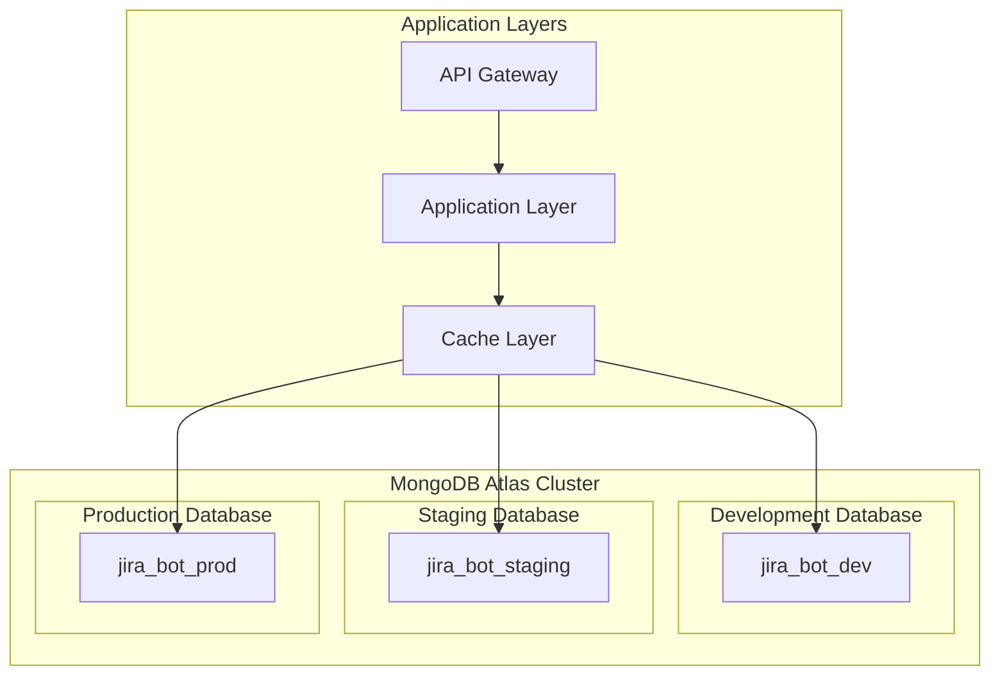
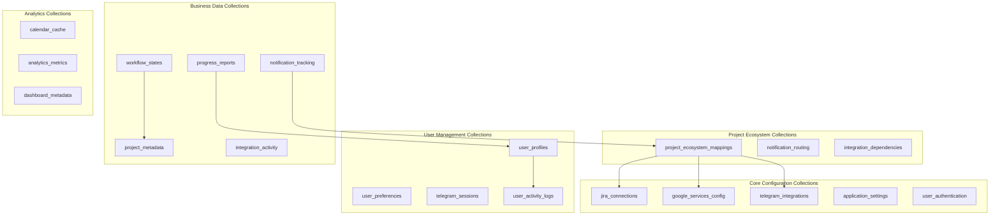
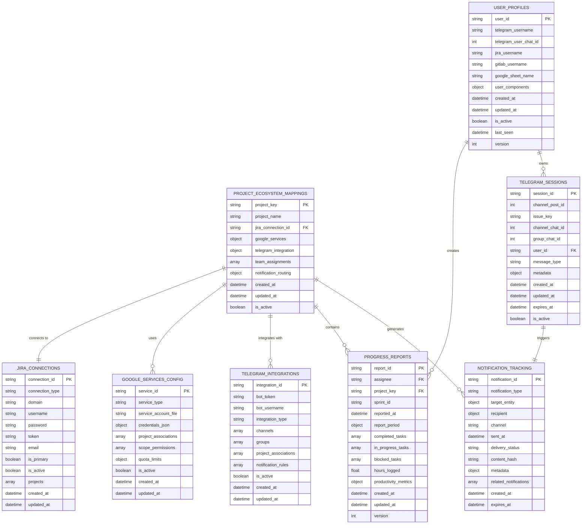
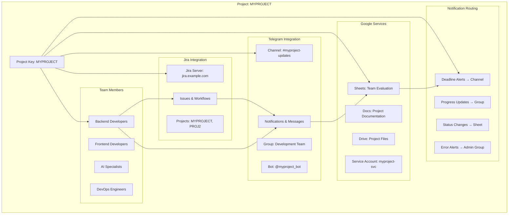
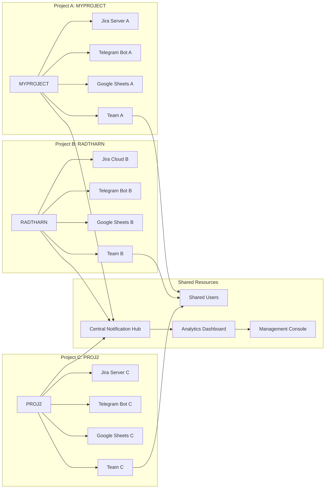
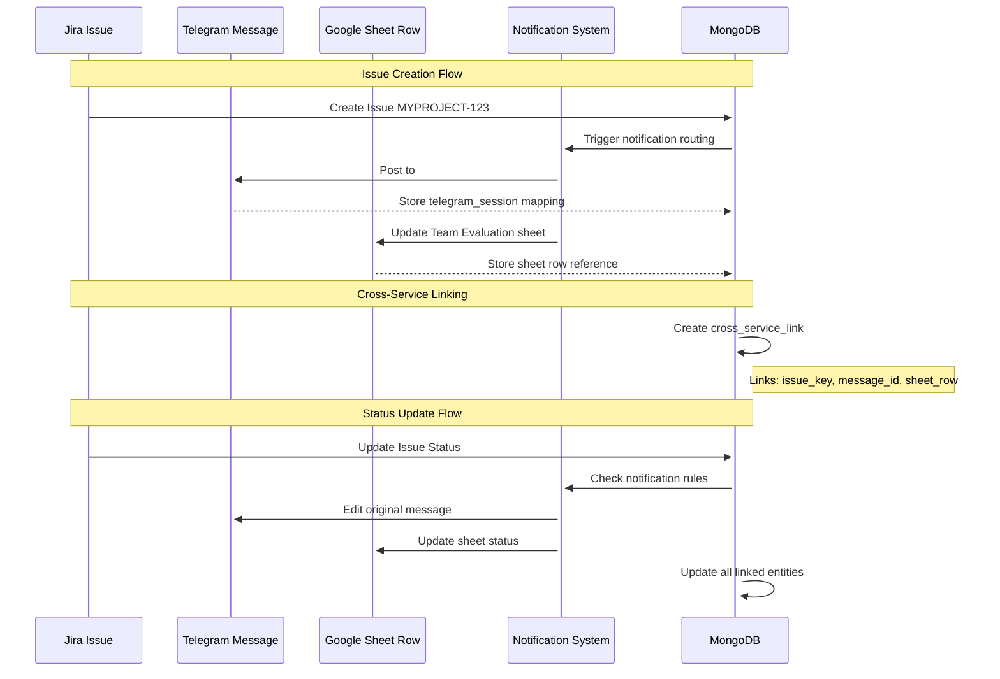
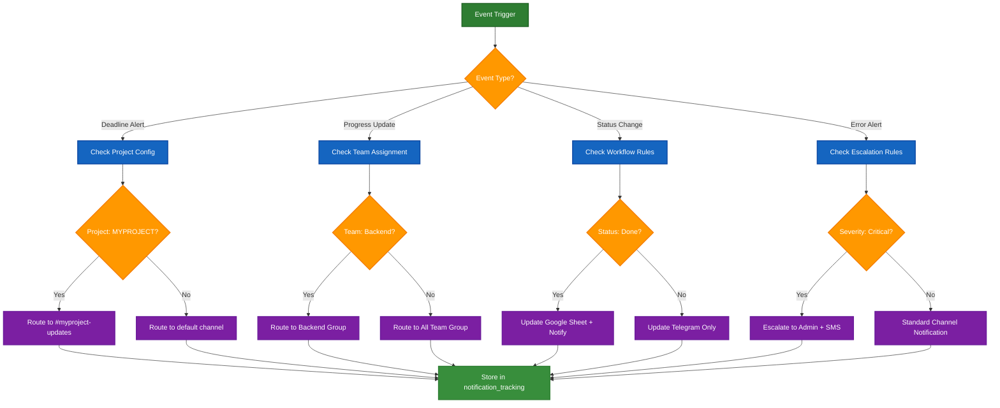
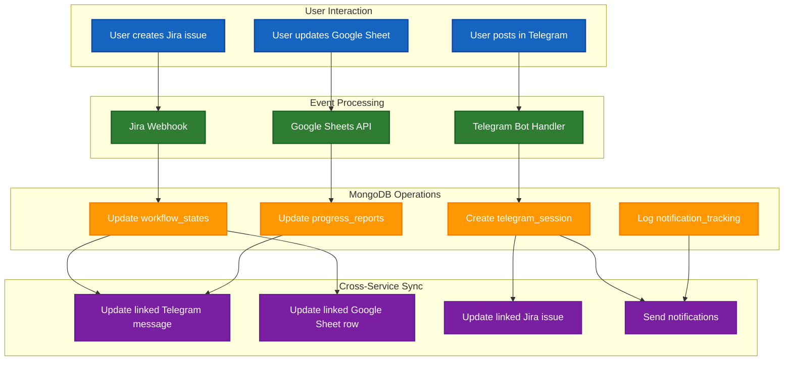
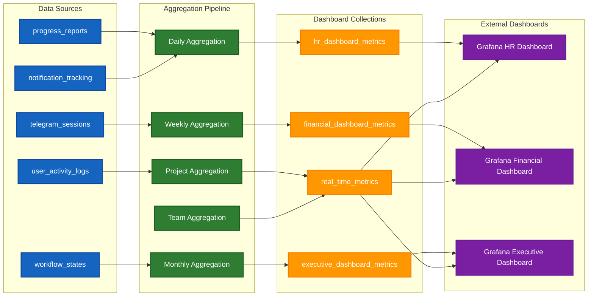

# 🌐 MongoDB Database Ecosystem Documentation

This document provides a comprehensive overview of the MongoDB database ecosystem for the jira-telegram-bot application, including all collections, relationships, and integration patterns.

## 📋 Table of Contents

1. [Database Overview](#database-overview)
2. [Collection Architecture](#collection-architecture)
3. [Entity Relationships](#entity-relationships)
4. [Project Ecosystem Flow](#project-ecosystem-flow)
5. [Integration Patterns](#integration-patterns)
6. [Data Flow Diagrams](#data-flow-diagrams)
7. [Schema Definitions](#schema-definitions)

## 🗄️ Database Overview

The MongoDB ecosystem is organized around **project-centric architecture** where each project becomes a self-contained integration hub connecting multiple services.



### Database Structure Per Environment

| Environment | Database Name | Purpose | Collections |
|------------|---------------|---------|-------------|
| Development | `jira_bot_dev` | Development and testing | All collections |
| Staging | `jira_bot_staging` | Pre-production testing | All collections |
| Production | `jira_bot_prod` | Live production data | All collections |

## 🏗️ Collection Architecture

The database is organized into logical groups based on functionality and relationships:



## 🔗 Entity Relationships

### Core Entity Relationship Diagram



## 🎯 Project Ecosystem Flow

### Project-Centric Integration Model



### Multi-Project Ecosystem



## 🔄 Integration Patterns

### Cross-Service Entity Linking



### Notification Routing Flow



## 📊 Data Flow Diagrams

### User Action Data Flow



### Analytics Data Aggregation



## 📋 Schema Definitions

### Core Collections Schema

#### project_ecosystem_mappings
```json
{
  "_id": "ObjectId",
  "project_key": "MYPROJECT",
  "project_name": "MyProject Development",
  "jira_connection_id": "jira_server_main",
  "google_services": {
    "sheets_service_id": "myproject_sheets_svc",
    "docs_service_id": "myproject_docs_svc",
    "primary_sheet_id": "1TCvcE_IsP6jpHp3pVfjND9Kys8rfsB5fp2Sx0LILwm4",
    "project_folder_id": "1BxYZ9876543210abcdef"
  },
  "telegram_integration": {
    "primary_channel_id": -1001234567890,
    "notification_channel_id": -1001234567891,
    "team_group_id": -1001234567892,
    "bot_integration_id": "myproject_bot_main"
  },
  "team_assignments": [
    {
      "user_id": "admin_user",
      "role": "DevOps Lead",
      "department": "DevOps",
      "access_level": "admin"
    },
    {
      "user_id": "dev_user_1",
      "role": "Backend Developer",
      "department": "Backend",
      "access_level": "developer"
    }
  ],
  "notification_routing": {
    "deadline_notifications": {
      "channel_id": -1001234567890,
      "mention_groups": ["@backend-team"],
      "severity_escalation": true
    },
    "progress_notifications": {
      "group_id": -1001234567892,
      "frequency": "daily",
      "include_metrics": true
    },
    "status_change_notifications": {
      "channel_id": -1001234567890,
      "update_google_sheet": true,
      "notify_stakeholders": true
    }
  },
  "created_at": "2025-09-01T00:00:00Z",
  "updated_at": "2025-09-01T00:00:00Z",
  "is_active": true
}
```

#### jira_connections
```json
{
  "_id": "ObjectId",
  "connection_id": "jira_server_main",
  "connection_type": "server",
  "domain": "https://jira.example.com",
  "username": "admin_user",
  "password": "encrypted_password_hash",
  "token": null,
  "email": null,
  "is_primary": true,
  "is_active": true,
  "projects": ["MYPROJECT", "PROJ2", "RADTHARN"],
  "api_config": {
    "timeout": 30,
    "retry_attempts": 3,
    "rate_limit": 100
  },
  "created_at": "2025-09-01T00:00:00Z",
  "updated_at": "2025-09-01T00:00:00Z"
}
```

#### telegram_integrations
```json
{
  "_id": "ObjectId",
  "integration_id": "myproject_bot_main",
  "bot_token": "encrypted_bot_token",
  "bot_username": "myproject_bot",
  "integration_type": "project",
  "channels": [
    {
      "channel_id": -1001234567890,
      "channel_name": "myproject-updates",
      "channel_type": "public",
      "project_associations": ["MYPROJECT"],
      "allowed_operations": ["post", "edit", "delete"],
      "notification_types": ["deadlines", "progress", "status"]
    }
  ],
  "groups": [
    {
      "group_id": -1001234567892,
      "group_name": "MyProject Development Team",
      "team_associations": ["Backend", "Frontend", "DevOps"],
      "allowed_users": ["admin_user", "dev_user_1", "dev_user_2"],
      "permissions": {
        "can_create_issues": true,
        "can_update_status": true,
        "can_assign_tasks": false
      }
    }
  ],
  "project_associations": ["MYPROJECT"],
  "notification_rules": [
    {
      "rule_id": "deadline_alerts",
      "trigger": "issue_deadline_approaching",
      "target_channel": -1001234567890,
      "conditions": {
        "days_before": 2,
        "priority": ["High", "Highest"],
        "project": "MYPROJECT"
      }
    }
  ],
  "is_active": true,
  "created_at": "2025-09-01T00:00:00Z",
  "updated_at": "2025-09-01T00:00:00Z"
}
```

### Index Strategy

#### Core Indexes
```javascript
// project_ecosystem_mappings
db.project_ecosystem_mappings.createIndex({ "project_key": 1 }, { unique: true })
db.project_ecosystem_mappings.createIndex({ "is_active": 1, "created_at": -1 })
db.project_ecosystem_mappings.createIndex({ "team_assignments.user_id": 1 })

// jira_connections
db.jira_connections.createIndex({ "connection_id": 1 }, { unique: true })
db.jira_connections.createIndex({ "is_active": 1, "is_primary": -1 })
db.jira_connections.createIndex({ "projects": 1 })

// telegram_integrations
db.telegram_integrations.createIndex({ "integration_id": 1 }, { unique: true })
db.telegram_integrations.createIndex({ "project_associations": 1 })
db.telegram_integrations.createIndex({ "channels.channel_id": 1 })
db.telegram_integrations.createIndex({ "groups.group_id": 1 })

// user_profiles
db.user_profiles.createIndex({ "user_id": 1 }, { unique: true })
db.user_profiles.createIndex({ "telegram_username": 1 }, { unique: true })
db.user_profiles.createIndex({ "jira_username": 1 })
db.user_profiles.createIndex({ "is_active": 1, "last_seen": -1 })

// progress_reports
db.progress_reports.createIndex({ "report_id": 1 }, { unique: true })
db.progress_reports.createIndex({ "assignee": 1, "reported_at": -1 })
db.progress_reports.createIndex({ "project_key": 1, "reported_at": -1 })
db.progress_reports.createIndex({ "sprint_id": 1 })

// telegram_sessions
db.telegram_sessions.createIndex({ "session_id": 1 }, { unique: true })
db.telegram_sessions.createIndex({ "channel_post_id": 1 }, { unique: true })
db.telegram_sessions.createIndex({ "issue_key": 1 })
db.telegram_sessions.createIndex({ "user_id": 1, "created_at": -1 })
db.telegram_sessions.createIndex({ "expires_at": 1 }, { expireAfterSeconds: 0 })

// notification_tracking
db.notification_tracking.createIndex({ "notification_id": 1 }, { unique: true })
db.notification_tracking.createIndex({ "target_entity.entity_id": 1, "sent_at": -1 })
db.notification_tracking.createIndex({ "recipient.user_id": 1, "sent_at": -1 })
db.notification_tracking.createIndex({ "expires_at": 1 }, { expireAfterSeconds: 0 })
```

## 🔍 Query Patterns

### Common Query Examples

#### Get Project Ecosystem
```javascript
// Get complete ecosystem for a project
db.project_ecosystem_mappings.aggregate([
  { $match: { "project_key": "MYPROJECT", "is_active": true } },
  {
    $lookup: {
      from: "jira_connections",
      localField: "jira_connection_id",
      foreignField: "connection_id",
      as: "jira_config"
    }
  },
  {
    $lookup: {
      from: "telegram_integrations",
      localField: "telegram_integration.bot_integration_id",
      foreignField: "integration_id",
      as: "telegram_config"
    }
  },
  {
    $lookup: {
      from: "google_services_config",
      localField: "google_services.sheets_service_id",
      foreignField: "service_id",
      as: "google_sheets_config"
    }
  }
])
```

#### Get User's Project Assignments
```javascript
// Get all projects assigned to a user
db.project_ecosystem_mappings.find({
  "team_assignments.user_id": "admin_user",
  "is_active": true
}, {
  "project_key": 1,
  "project_name": 1,
  "team_assignments.$": 1
})
```

#### Get Notification Routing Rules
```javascript
// Get notification routing for project deadlines
db.project_ecosystem_mappings.aggregate([
  { $match: { "project_key": "MYPROJECT" } },
  {
    $lookup: {
      from: "telegram_integrations",
      localField: "telegram_integration.bot_integration_id",
      foreignField: "integration_id",
      as: "telegram_config"
    }
  },
  {
    $project: {
      "project_key": 1,
      "deadline_routing": "$notification_routing.deadline_notifications",
      "telegram_channels": "$telegram_config.channels"
    }
  }
])
```

This ecosystem documentation provides a complete view of how all the services, data, and integrations work together in a project-centric model. Each project becomes its own self-contained integration hub while maintaining flexibility for cross-project shared resources and users.
